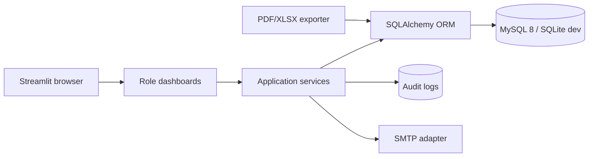
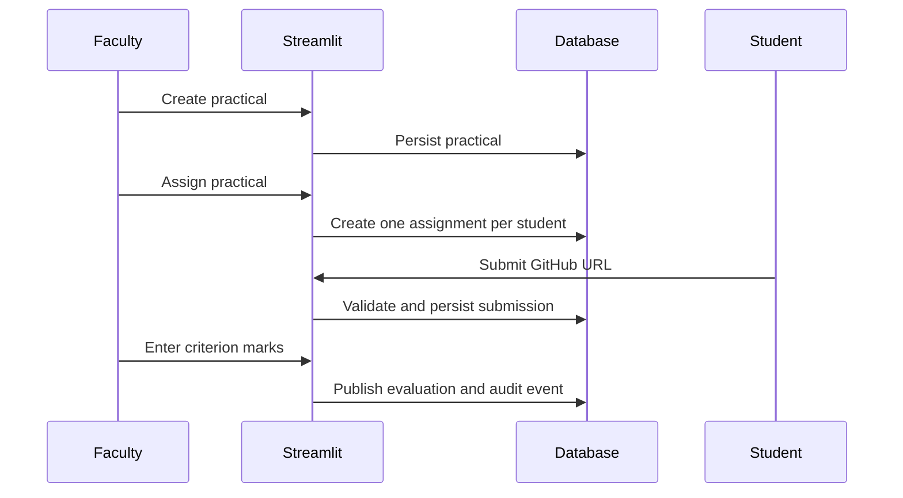
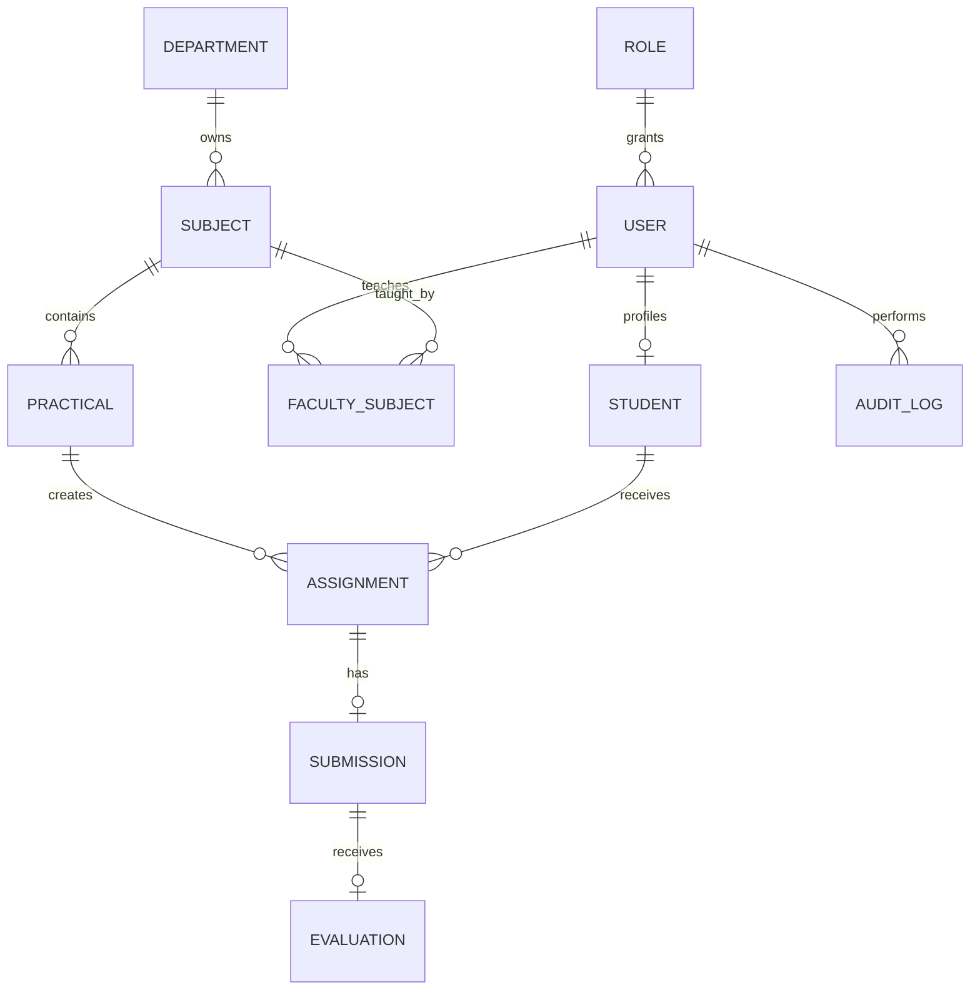

# Architecture

The UI is deliberately thin. Domain transitions live in `services.py`, persistence is represented by `models.py`, and configuration is environment-based. Email, GitHub API validation, scheduled reminders, and background jobs should be introduced as adapters around the service boundary.

## Core sequence

## ER overview

